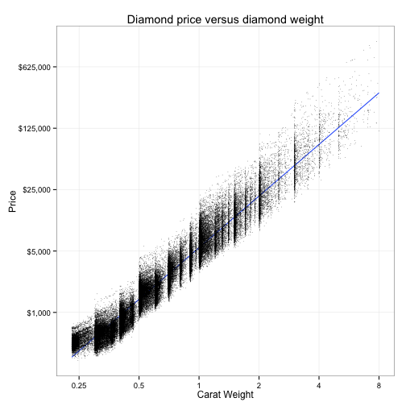
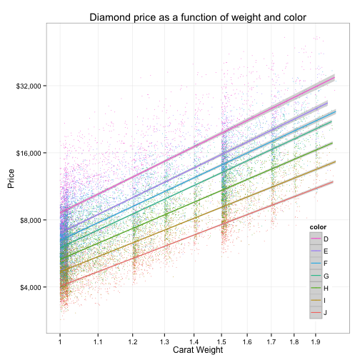
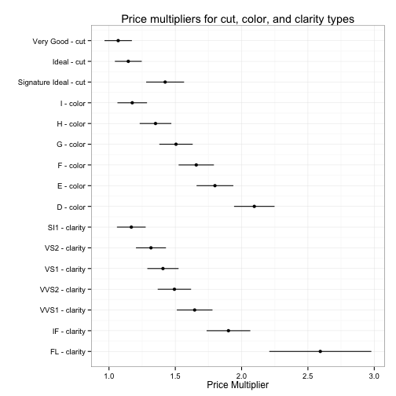
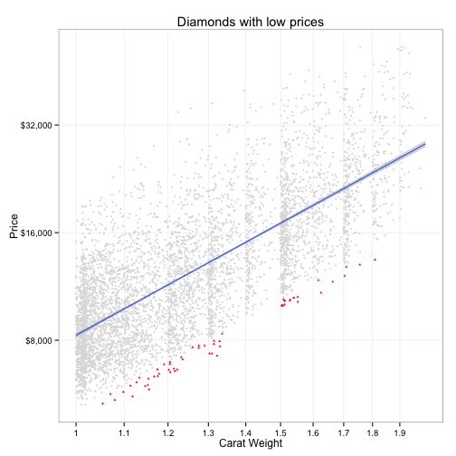

Looking to buy a diamond? This how-to guide describes three
steps I took to identify great deals on [Blue
Nile][blue-nile]. "Founded in 1999, Blue Nile has grown to become the
largest online retailer of certified diamonds and fine jewelry." The
code used in this analysis is available on [GitHub][repo]. This guide
proceeds as follows:

1.  download data from Blue Nile,
2.  model price as a function of diamond characteristics, and
3.  identify diamonds with extra low prices.

# Downloading Data

I've written a Python script to make downloading data from Blue Nile
easy. The script has been posted [here][download.py]. To download data
on all round diamonds on Blue Nile use the following command:

    python download.py --shape RD > my-diamonds.csv

For more information on the optional arguments the script accepts use:

    python download.py --help

Most of the download script is pretty easy to follow. Blue Nile is
using Apache Solr to serve JSON documents describing diamonds on
the site. The trickiest part is you can only get information on the
first 1,000 diamonds for each query; Blue Nile has limited how far we
can page through results. To work around this constraint, the download
script pages through results based on price. I only mention this if
you want to dig deeper into the download script.


On November 6, 2015, I downloaded data on all
98,886 round diamonds on Blue Nile. Below is a
plot of diamond price versus carat weight (both on log scales).

 

# Modeling Price

Blue Nile's [buying guide][buying-guide] describes how the four C's
(cut, color, clarity, and carat weight) are the most important
characteristics when buying a diamond. It seems reasonable to model
price as a function of those four characteristics. Having played
around with the data bit, a multiplicative model seems like a good
choice. I model price as a product of carat weight raised to the power
$\beta$ times multipliers for the cut, color, and clarity of the
diamond
$$
price\_i \propto carat\_i^\beta \cdot cut\_i \cdot color\_i \cdot clarity\_i.
$$
Taking $\log$'s of both sides allows this model to be estimated using
a linear regression
$$
\log(price\_i) = \alpha + \beta \log(carat\_i) + \delta\_{cut\_i} +
\delta\_{color\_i} + \delta\_{clarity\_i} + \epsilon\_i.
$$
Focusing on diamonds weighing between 1.00 and 1.99 carats, we can see
the relationship between $\log(price\_i)$ and $\log(carat\_i)$ is
remarkably linear, with diamond color shifting the intercept but not
the slope of the relationship.

 

Below is a summary of the fitted linear model. Generally, I put very
little weight on R-squared values, but this model explains 91.5% of
the observed variance in log price!


```
## 
## Call:
## lm(formula = fstring, data = diamonds)
## 
## Residuals:
##      Min       1Q   Median       3Q      Max 
## -0.58043 -0.09121  0.00130  0.08608  0.62971 
## 
## Coefficients:
##             Estimate Std. Error t value Pr(>|t|)    
## (Intercept) 7.904912   0.004815 1641.74   <2e-16 ***
## log(carat)  1.695256   0.005421  312.69   <2e-16 ***
## cut2        0.067069   0.003694   18.16   <2e-16 ***
## cut3        0.135940   0.003307   41.11   <2e-16 ***
## cut4        0.352969   0.005307   66.51   <2e-16 ***
## color2      0.161501   0.003914   41.26   <2e-16 ***
## color3      0.300675   0.003900   77.10   <2e-16 ***
## color4      0.409028   0.003890  105.16   <2e-16 ***
## color5      0.505657   0.003945  128.16   <2e-16 ***
## color6      0.587193   0.003949  148.71   <2e-16 ***
## color7      0.739886   0.004113  179.90   <2e-16 ***
## clarity2    0.155532   0.003710   41.92   <2e-16 ***
## clarity3    0.275004   0.003591   76.58   <2e-16 ***
## clarity4    0.341406   0.003642   93.74   <2e-16 ***
## clarity5    0.400936   0.003921  102.26   <2e-16 ***
## clarity6    0.498296   0.004064  122.61   <2e-16 ***
## clarity7    0.642261   0.005277  121.70   <2e-16 ***
## clarity8    0.952975   0.021096   45.17   <2e-16 ***
## ---
## Signif. codes:  0 '***' 0.001 '**' 0.01 '*' 0.05 '.' 0.1 ' ' 1
## 
## Residual standard error: 0.1408 on 19997 degrees of freedom
## Multiple R-squared:  0.9153,	Adjusted R-squared:  0.9152 
## F-statistic: 1.27e+04 on 17 and 19997 DF,  p-value: < 2.2e-16
```

Exponentiating the coefficients from the regression model gives
estimates of the price multipliers associated with different diamond
characteristics. These multipliers can help a shopper decide what type
of diamond to consider. The omitted categories (cut = Good, color = J,
and clarity = SI2) have implicit coefficients of 0 and price
multipliers of 1. Is a G-color diamond worth
1.51 times the price of a J-color
diamond with the same cut, clarity, and carat weight?

 

# Identifying Deals

Having read Blue Nile's buying guide a few times, they've convinced me
to care about all four of the four C's. When purchasing a diamond, the
following cut, color, and clarity are my baseline:

* $cut\_i \ge$ Ideal: Represents roughly the top 3% of diamond quality
  based on cut. Reflects nearly all light that enters the diamond. An
  exquisite and rare cut.

* $color\_i \ge$ H: Near-colorless. Color difficult to detect unless
  compared side-by-side against diamonds of better grades. An
  excellent value.

* $clarity\_i \ge$ VS1: Very Slightly Included: Imperfections are not
  typically visible to the unaided eye. Less expensive than the VVS1
  or VVS2 grades.

Below I plot the diamonds that meet my baseline. Fitting a linear
relationship between $\log(price\_i)$ and $\log(carat\_i)$, I highlight
the best 1% of deals, the diamonds where the difference between
expected and actual price is greatest
$$
\alpha + \beta \log(carat\_i) - \log(p\_i) = -\epsilon\_i.
$$

 

The table below describes the top 10 diamonds found using my
criteria. All of these diamonds have an ideal cut and H-color.

| Residual|Clarity | Carat|  Price|
|--------:|:-------|-----:|------:|
|    -0.63|VS1     |  1.32|  7,238|
|    -0.61|VS1     |  1.15|  5,830|
|    -0.59|VS1     |  1.30|  7,344|
|    -0.59|VS1     |  1.30|  7,346|
|    -0.59|VVS2    |  1.62| 10,866|
|    -0.59|VS1     |  1.11|  5,575|
|    -0.58|VS1     |  1.22|  6,623|
|    -0.58|VS1     |  1.15|  5,999|
|    -0.58|VS1     |  1.21|  6,566|
|    -0.57|VVS2    |  1.32|  7,691|

Disclaimer: This is one way to identify deals. A more general solution
would allow shoppers to enter preference parameters similar to the
regression coefficients found above. Taking preference parameters
$\beta$, the best deals would maximize the shopper's utility
$$
u(X\_i, p\_i) = X\_i \beta - p\_i.
$$

[blue-nile]: http://www.bluenile.com/
[solr]: http://lucene.apache.org/solr/
[buying-guide]: http://www.bluenile.com/education/diamonds/
[delta-method]: http://www.ats.ucla.edu/stat/r/faq/deltamethod.htm
[repo]: https://github.com/amarder/diamonds
[download.py]: https://github.com/amarder/diamonds/blob/master/download.py
