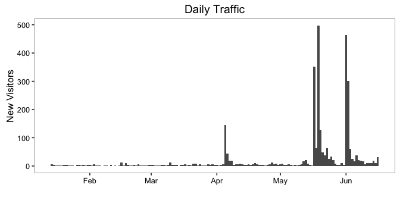
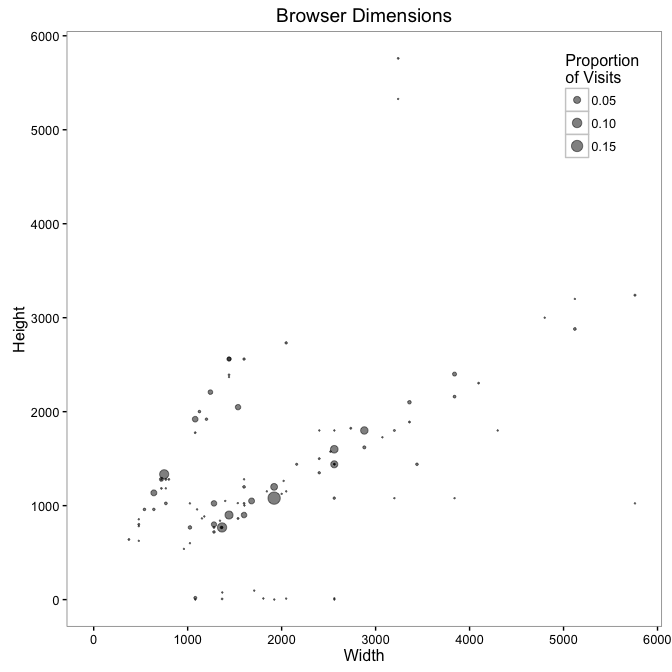
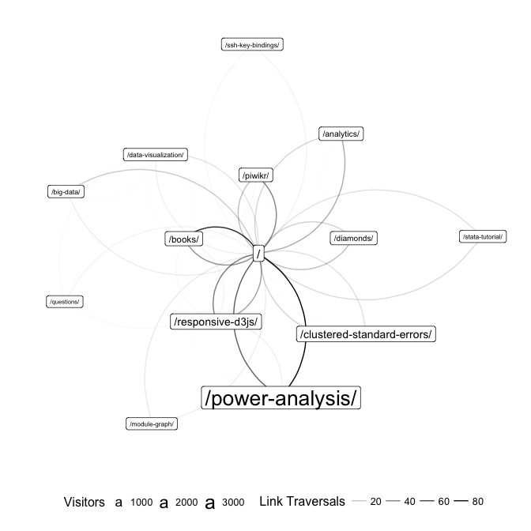

[Piwik][piwik] is the web analytics framework for hackers. By providing access to raw page view data, Piwik allows analysts to use general purpose tools for analysis. Piwik stores all of its data in a MySQL database. I've written an R library [piwikr][piwikr] to download and clean the tables stored in Piwik's database. To get started let's connect to the database:


```r
library(piwikr)

my_db <- src_mysql(
    host = "host.com",
    user = "andrew",
    password = "xxxxx",
    dbname = "piwik"
)
```


Below I retrieve tables describing all visits to the site and all actions taken by visitors to the site.


```r
visits <- get_visits(my_db)
actions <- get_actions(my_db)
```

piwikr comes with functions to compute new tables from the primary tables. The four tables constructed below describe visitors to the site, days the site was actively collecting data, pages on the site, and sources of traffic to the site.


```r
visitors <- compute_visitors(actions)
days <- compute_days(actions)
pages <- compute_pages(actions, base_url = "amarder.github.io")
sources <- compute_sources(visits)
```

# Traffic Over Time

piwikr also comes with functions for creating graphs. How much traffic has the site generated over time?


```r
graph_visitors_vs_date(days)
```



```r
nvisitors <- nrow(visitors)
ndays <- as.numeric(max(actions$day) - min(actions$day))
arrival_rate <- nvisitors / ndays
```

The site has attracted 3076 visitors over 155 days. The overall arrival rate was 19.85 visitors per day.

# Popular Content

What pages on the site have been viewed by the most visitors?


```r
library(dplyr)
library(pander)

pages %>%
    mutate(Page = paste0('<a href="https://amarder.github.io', page, '">', page, "</a>")) %>%
    select(Page, Visitors = visitors) %>%
    head(10) %>%
    pandoc.table(style = "rmarkdown", split.table = Inf, justify = "ll")
```


| Page                                                                                           | Visitors   |
|:-----------------------------------------------------------------------------------------------|:-----------|
| <a href="https://amarder.github.io/power-analysis/">/power-analysis/</a>                       | 2363       |
| <a href="https://amarder.github.io/clustered-standard-errors/">/clustered-standard-errors/</a> | 320        |
| <a href="https://amarder.github.io/responsive-d3js/">/responsive-d3js/</a>                     | 280        |
| <a href="https://amarder.github.io/">/</a>                                                     | 147        |
| <a href="https://amarder.github.io/analytics/">/analytics/</a>                                 | 61         |
| <a href="https://amarder.github.io/piwikr/">/piwikr/</a>                                       | 50         |
| <a href="https://amarder.github.io/diamonds/">/diamonds/</a>                                   | 48         |
| <a href="https://amarder.github.io/books/">/books/</a>                                         | 43         |
| <a href="https://amarder.github.io/big-data/">/big-data/</a>                                   | 17         |
| <a href="https://amarder.github.io/data-visualization/">/data-visualization/</a>               | 17         |

# Referrals

How are visitors finding the site?


```r
sources %>%
    select(Source = source, Visitors = visitors) %>%
    head(10) %>%
    pandoc.table(style='rmarkdown', justify='ll')
```


| Source                    | Visitors   |
|:--------------------------|:-----------|
| (direct)                  | 2338       |
| Google                    | 327        |
| t.co                      | 155        |
| feedly.com                | 52         |
| flipboard.com             | 43         |
| news.ycombinator.com      | 40         |
| popurls.com               | 10         |
| post.oreilly.com          | 9          |
| us3.campaign-archive1.com | 8          |
| us6.campaign-archive2.com | 8          |

# Browser Resolutions

How important is mobile / how large are the visitors' browser windows?


```r
graph_browser_resolutions(visits)
```



```r
pct_mobile <- 100 * mean(visits$screen_width < 800, na.rm = TRUE)
```

14.6% of visits were performed on a screen with width less than 800 pixels.

# Site Structure

piwikr can also visualize how users navigate from page to page on the site. Each node in the graph below represents a page on the site, the size of a node is proportional to the number of visitors who have viewed the page. The width of each edge is proportional to the number of visitors that traveled between the two pages.


```r
set.seed(2)
graph_site_structure(actions, base_url = "amarder.github.io", n = 14)
```



[piwik]: http://piwik.org/
[piwikr]: https://github.com/amarder/piwikr
