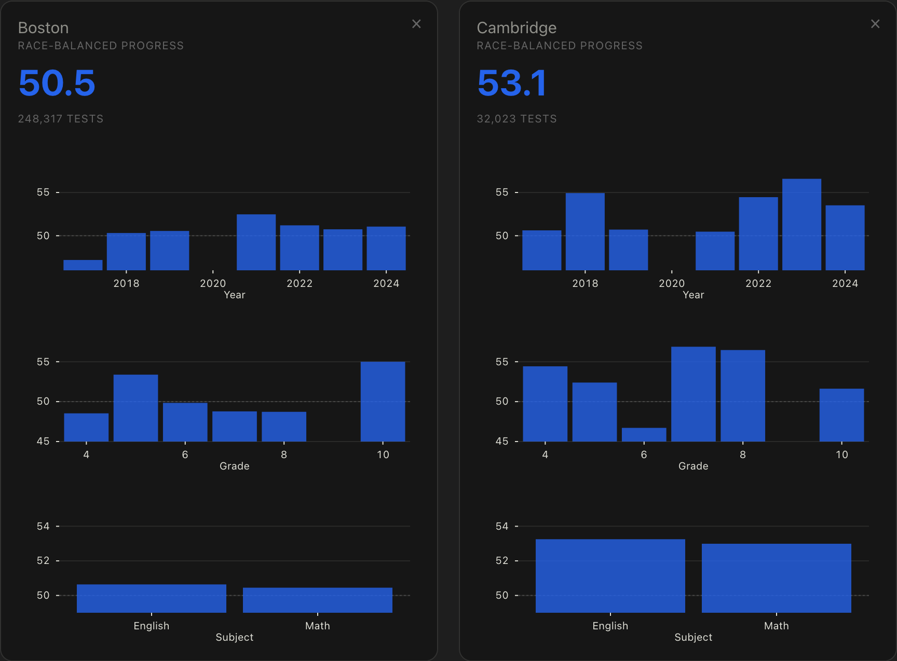

**Major Update to Locovote**: Better School Comparisons Based on Recent Research

I've updated [Locovote](https://locovote.com/school-districts) with improved school district comparisons based on [MIT research](https://doi.org/10.1257/aeri.20220292) showing that traditional school ratings can be misleading, reflecting student demographics rather than school quality.

**What this means:** Locovote now includes adjusted metrics that aim to measure actual school value-added while removing selection bias. This gives Massachusetts families a clearer picture of school quality when comparing districts.

Check out the updated comparisons at https://locovote.com/school-districts and let me know what you think! 

#Education #DataScience #Massachusetts #SchoolChoice #Research #OpenSource

