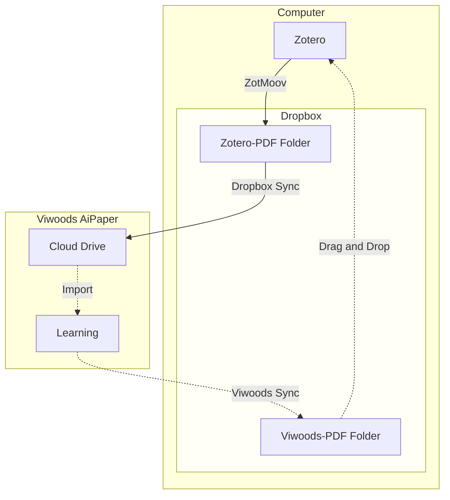

I splurged and got myself an e-ink tablet. Specifically, I picked up a [Viwoods AiPaper](https://www.amazon.com/VIWOODS-Electronic-Ultra-Thin-Lightweight-Note-Taking/dp/B0DZ1TJYLN?tag=andrewmarder-20). I value that it runs Android and doesn't push me into a subscription. It's a quirky product so I wanted to write some notes about how I use it. I have two main use cases:

1. Taking notes
2. Reading PDF files

For taking notes I use the "Paper" app. For reading PDFs I use the "Learning" app. 

## Sync

I use [Zotero](/zotero) on my computer to manage references and PDF files. I've set up ZotMoov to store Zotero attachments in my Dropbox folder. I've also connected the tablet to my Dropbox account so I can easily import PDF files from Dropbox into the Learning app. When I'm done annotating a PDF file I use Viwoods Sync to push that document up to Dropbox, and then I manually drag and drop the annotated file back into Zotero. The solid lines in the diagram below are automatic, the dotted lines are manual. Overall, I think this flow is fine. It's not seamless, but it gets the job done.

## Stylus

The stylus that comes with the Viwoods AiPaper is okay. I think the Apple Pencil is an excellent input device, great weight, smooth writing experience, it feels solid and good in the hand. I would give the Apple Pencil an "A", and the Viwoods Stylus a "B". I think my main complaint with the Viwoods Stylus is the eraser and button rattle around a bit. It doens't feel solid. I tried (and returned) two other styluses:

1. [STAEDTLER Noris Classic](https://www.amazon.com/dp/B0728HBD7F?tag=andrewmarder-20)
2. [STAEDTLER Noris Jumbo](https://www.amazon.com/dp/B086N4KK7Z?tag=andrewmarder-20)

The Norris Classic was solid (no button, no eraser, no rattle), but it was way too light and too skinny to be held by the loop on the case. The Noris Jumbo had an eraser and a slight rattle. The Jumbo was probably *slightly* better than the Viwoods Stylus, but not better enough to justify the price. I wish rOtring made an EMR stylus, I love their mechanical pencils. If you have any stylus suggestions definitely let me know in the comments.

## iPad Comparison

Back in 2019, I bought a second generation Apple Pencil and a first generation 11-inch iPad Pro. It still works great. In terms of a general purpose tablet, the iPad crushes the AiPaper:

- I prefer the Apple pencil to the Viwoods stylus
- The software available on iPad is superb.
    - [Notability](https://notability.com/) is way better than Viwoods Paper.
    - [PDF Expert](https://pdfexpert.com/) is way better than Viwoods Learning.
    - [Box](https://www.box.com/) is easy to install. I think Box is better than Dropbox. Unfortunately, installing Box requires the Google Play Store and I haven't successfully set that up yet.

Here are the places where AiPaper excels:

- **Battery**. The stylus doesn't use electricity. The Apple Pencil is a major drain on the iPad battery. I have to charge the iPad daily, and if I leave the pencil attached when storing the iPad then the iPad battery will be completely drained when I come back to it. Battery life on the AiPaper is great.

- **Focus**. Since the iPad is general purpose it can be quite distracting. The AiPaper is less distracting and that's great, especially for meetings.

- **Weight**. The AiPaper is lightweight and thin, which is great. My iPad is a little bulky.

- **Discrete**. I like the monochrome screen. If I take notes with the AiPaper in a meeting, folks will be less concerned that I'm multitasking / not paying attention to the meeting.

Overall, I think I'll have fun with the AiPaper, but right now I wouldn't suggest it to others.