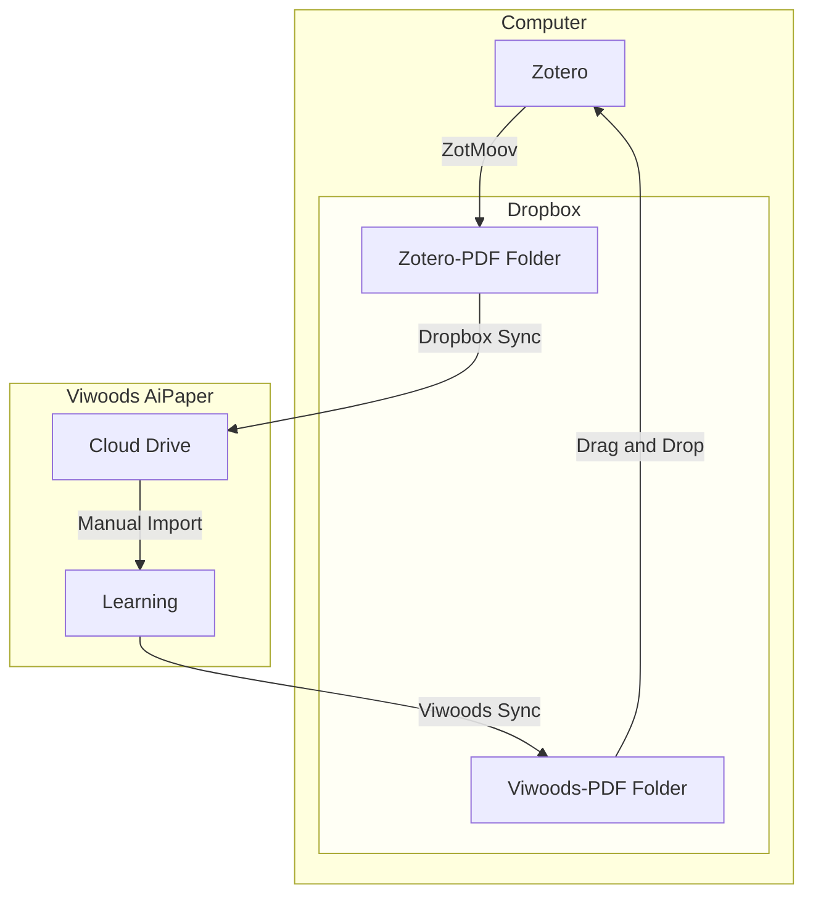

I splurged and got myself an e-ink tablet. Specifically, I picked up a [Viwoods AiPaper](https://www.amazon.com/VIWOODS-Electronic-Ultra-Thin-Lightweight-Note-Taking/dp/B0DZ1TJYLN?tag=andrewmarder-20). It's a quirky tablet so I wanted to write some notes about how I use it. I have two main use cases:

1. Taking notes
2. Reading papers

For taking notes I use the "Paper" app. For reading papers I use the "Learning" app. I use [Zotero](/zotero) to manage references and PDF files. I use Dropbox to sync those files between my computer and tablet.

## Sync

## Stylus

- [STAEDTLER Noris Classic](https://www.amazon.com/dp/B0728HBD7F?tag=andrewmarder-20)

- [STAEDTLER Noris Jumbo](https://www.amazon.com/dp/B086N4KK7Z?tag=andrewmarder-20)