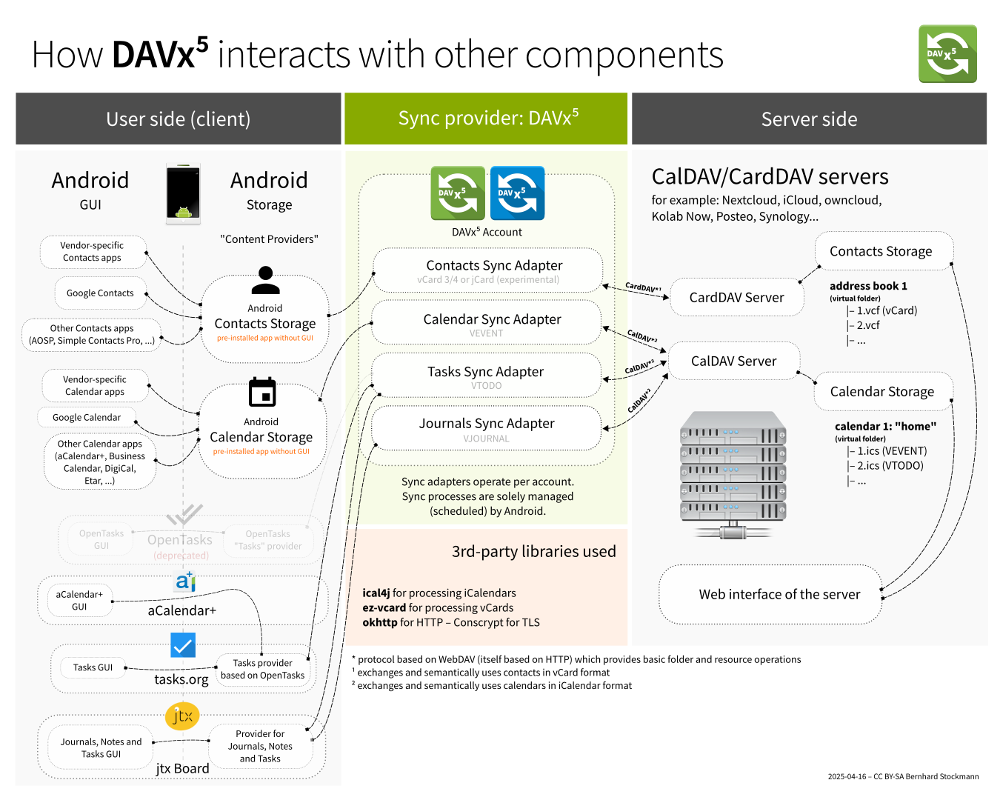

import { Icon } from "astro-icon/components";

I'll be completely honest - I found synching my Fastmail contacts and calendars with my Android phone clunky and confusing. Android doesn't natively support the CalDAV and CardDAV protocols used to sync calendars and contacts. [DAVx⁵](https://www.davx5.com/) fills that gap - it's an open-source sync adapter that connects your Android device to any CalDAV/CardDAV server, including Fastmail. I'm writing the guide I would have wanted if I was setting up DAVx5 for the first time to sync with a Fastmail account.

DAVx⁵ is available on [Google Play](https://play.google.com/store/apps/details?id=at.bitfire.davdroid&hl=en_US) (currently $6.49) and on [F-Droid](https://f-droid.org/packages/at.bitfire.davdroid/) (donations encouraged). Below is a nice diagram illustrating how the DAVx⁵ app keeps your contacts and calendars in sync with the server (copied from the [introduction](https://manual.davx5.com/introduction.html) to the DAVx⁵ manual).

## Setup

DAVx⁵ supports two ways to connect with Fastmail: OAuth and app passwords. You'll need a Fastmail Standard plan or higher for this to work. Fastmail Basic plans don't include app passwords, CalDAV, or CardDAV access. Here's how to connect your account via OAuth:

1. Open DAVx⁵ and tap the **+ Add account** button
2. Choose **Fastmail** in the **Provider-specific login** section
3. Sign in using your fastmail.com email address
3. Allow DAVx⁵ to (1) Download, modify, and permanently delete your contacts and contact groups (2) download, modify, and permanently delete your calandars and events.
4. Select the account you want to use as the calendar event organizer, this is important if you use a custom domain (I selected andrew@andrewmarder.net not my Fastmail email address). 
5. Keep the default setting of **Contact group method = Groups are separate vCards**.
6. Click the **Finish** button.
7. On both the CalDAV and CardDAV tabs, toggle them on so your calendar and contacts are kept in sync.

The initial sync of contacts can be **extremely** frustrating. For each contact, DAVx⁵ will download the contact's avatar from the email provider. I have a few hundred contacts and I had to let DAVx⁵ run over night to download them all. There is very little indication from the UI what's happening and reading the log files was not super helpful. I didn't have any issues with the initial calendar sync - since it downloads data from Fastmail only. My best advice here is try to be patient.

DAVx⁵ gets your data into Android Storage, now you need to configure your apps to use the right place in storage. I'm currently using [Fossify Calendar](https://play.google.com/store/apps/details?id=org.fossify.calendar) and Google Contacts but let me know if there are better apps out there (Fossify Contacts looks popular).

### Fossify Calendar

In Settings, toggle CalDAV sync on. Select the calendars you want to sync. Your events should show up! Sometimes I click the three dots in the search bar and select "Refresh CalDAV calendars" I'm not totally sure when that's necessary or not.

### Google Contacts

Click the avatar in the search bar, select "Contacts settings" choose the "Default account for new contacts" choose "Device and DAVx⁵ Address book". You should be good to go!

## Manual Sync

Each account in DAVx⁵ has separate tabs for CardDAV (address books) and CalDAV (calendars), but you don't need to sync each tab individually. Tap the **<Icon name="mdi:sync" class="inline h-[1em] w-[1em]" /> Synchronize now** button at the bottom of the screen and DAVx⁵ will sync all tabs at once. There's also a **Sync all** button on the main accounts screen that syncs all accounts in one tap.

If something goes wrong, DAVx⁵ posts a notification with a summary of the error. Tap the notification to see details. For deeper investigation, go to **DAVx⁵ → Settings → Verbose logging** and toggle it on. DAVx⁵ will write a detailed log of every HTTP request and response to a file. A persistent notification appears with a **Share** action you can use to send the log to an email app or file manager. Turn verbose logging off when you're done — the log is deleted automatically.

## Things to Know

- **Allow unrestricted battery usage.** Android will throttle or stop DAVx⁵'s background sync to save battery unless you exempt it. Go to **Settings → Apps → DAVx⁵ → Battery** (or **App battery usage**) and select **Unrestricted**. Without this, syncs may only happen when you manually open the app.
- **Manufacturer-specific app killing.** Even after setting "Unrestricted" in stock Android, phones from Xiaomi, Huawei, OnePlus, Oppo, Samsung, and others layer on their own autostart prevention and background restrictions that can silently kill DAVx⁵. Check [dontkillmyapp.com](https://dontkillmyapp.com/) for device-specific instructions.
- **Existing device contacts don't sync up automatically.** If you already have contacts stored locally on your phone, DAVx⁵ won't copy them to Fastmail. You'll need to [import them into Fastmail](https://www.fastmail.help/hc/en-us/articles/1500000280081) separately.
- **Sync interval.** DAVx⁵ can sync on change and on a schedule, but exact timing depends on your sync interval settings and Android's battery/network restrictions. You can adjust the interval in DAVx⁵'s account settings or trigger a manual sync at any time. I believe the default sync interval is every 4 hours.
- **Read-only subscription calendars.** If you subscribe to external calendar feeds in Fastmail (e.g. a shared team calendar or a public holiday feed), those sync as read-only. If you add a reminder to an event in one of those calendars on your phone, DAVx⁵ will try to push the change, get an HTTP 403 Forbidden error from Fastmail, and keep retrying every sync cycle until you remove the reminder.
- **VPN battery drain.** If you use a persistent VPN (like WireGuard) and lose your network connection, DAVx⁵ can enter a loop of failed connection attempts that drains your battery. The VPN reports a connected tunnel but there's no actual internet, so DAVx⁵ keeps retrying.

:::warning{title=Postscript}
This shouldn't be this hard. Google has purposefully made this hard to lock users into their ecosystem. I applaud the crew behind DAVx⁵ for fighting the good fight and supporting open standards.
:::