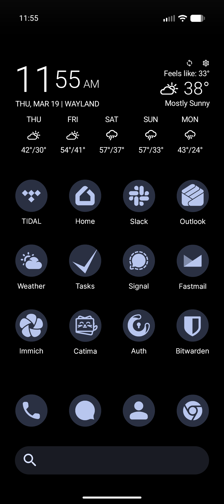

I was having a hard time syncing my contacts from Fastmail with my Google Pixel. As I dug into the issue a bit, I had a feeling that Google's flavor of Android was making things difficult. I decided it was time to give [GrapheneOS](https://grapheneos.org/) a try.

> GrapheneOS is a privacy and security focused mobile OS with Android app compatibility developed as a non-profit open source project. It's focused on the research and development of privacy and security technology including substantial improvements to sandboxing, exploit mitigations and the permission model. It was founded in 2014 and was formerly known as CopperheadOS.

I'm a few days into using GrapheneOS and it is a breath of fresh air. Google's Android has surveillance baked-in. They watch everything I do on my phone, record that data, and use that data to bombard me with ads. Moving to GrapheneOS has transformed my phone into a tool for me (not Google).

## Privacy

The primary reason I've switched over to GrapheneOS is privacy. I don't like having big brother Google watching what I do on my phone. I haven't personally verified any of GrapheneOS's privacy claims, but in everything I've read online it has an excellent reputation on this front. I'm open to hearing more about other operating systems, but at the moment I'm quite happy.

## Apps

Here's what I use my phone for:

1. Communication
2. Web Browsing
3. Writing (keyboard)
4. Photos
5. Weather
6. Maps
7. Smart Home

##### Communication

I use US Mobile's Dark Star (AT&T) network. I was pleasantly surprised that installing GrapheneOS didn't wipe my eSIM, and my phone was working right out of the gate. Here's a quick rundown of communication on GrapheneOS:

- The built-in phone app is solid and reliable, that's what I use.
- The built-in messaging and contacts apps are intentionally minimal, so I've installed [QUIK](https://github.com/quik-sms/quik) for messaging and [Fossify Contacts](https://github.com/FossifyOrg/Contacts).

:::warning
I don't think it will be possible to set up visual voicemail with GrapheneOS on US Mobile's Dark Star (AT&T) network. This is a little bit of bummer, but I'll get over it.
:::

##### Web Browser

The built-in web browser [Vanadium](https://grapheneos.org/features#vanadium) is superb. "Vanadium is a hardened variant of Chromium providing enhanced privacy and security, similar to how GrapheneOS compares to Android
Open Source Project (AOSP)." I had previously been using Firefox on my phone with some security tweaks - Vanadium is way better out of the box, and a nice upgrade for me.

##### Keyboard

The built-in keyboard is meant to be replaced. I tried a few options:

- [FUTO Keyboard](https://keyboard.futo.org/): great voice to text, terrible glide typing
- [HeliBoard](https://github.com/HeliBorg/HeliBoard): good (but not great) glide typing
- [Gboard](https://play.google.com/store/apps/details?id=com.google.android.inputmethod.latin): excellent glide typing

I've decided to use Gboard with no network permissions so it can't send data back to Google.

##### Photos

The AOSP camera app is a major downgrade from what shipped with the Pixel. So, I reinstalled the [Pixel Camera](https://play.google.com/store/apps/details?id=com.google.android.GoogleCamera). I'm also playing around with [Open Camera](https://play.google.com/store/apps/details?id=net.sourceforge.opencamera) but it's less of a point-and-shoot camera app, and more designed for a hardcore photographer.

##### Weather

Google's weather app is very good. I've replaced it with [WeatherMaster](https://github.com/PranshulGG/WeatherMaster), which is pretty good. I did have some issues with its widgets though, so I also installed [Today Weather](https://play.google.com/store/apps/details?id=mobi.lockdown.weather) just for the widgets.

##### Maps

I'm trying my hand at using [OsmAnd](https://osmand.net/) for maps. I haven't tested this out much, and I wouldn't be surprised if I revert back to using Google Maps.

:::warning
Unfortunately Android Auto is not compatible with GrapheneOS. I miss not being able to use the screen in my car. I'm fine sacrificing this feature for privacy. I guess it's time for me to invest in a phone mount again. Any tips?
:::

##### Smart Home

Unfortunately, my home has Nest thermostats, so Google has a view into some of the activity in my home. For that reason, I'm currently using Google Home. It works totally fine on GrapheneOS. I have set up [Home Assistant](https://www.home-assistant.io/) but found Google Home is easier for my family.

##### Launcher

I saw a screenshot of [Lawnchair](https://lawnchair.app/) in use and decided I needed to pimp out my desktop:

I believe you could use Lawnchair on any Android phone.

## Notifications

The default setting for notifications has it set so no sensitive content is shown on the lock screen. This is surprisingly awesome. I can see that I got an email but I can't see who it's from or what it's about. Having that extra step of unlocking my phone to see the content of the message is really nice. It gives me a second to decide if I want to leave what I'm doing to read an email.

## Modes

> Minimize distractions and take control of your attention with modes for sleep, work, driving, and everything in between.

I like putting my phone in gray mode after 9pm. It's awesome how easy it is to set up a mode for that.

## Conclusion

Losing Android Auto is a bummer. Losing visual voicemail is a little bummer. Transforming my phone from something that was spying on me, into a tool that works for me (and only me) is so worth it. I do worry that Google will try to kill GrapheneOS if it gets too popular.