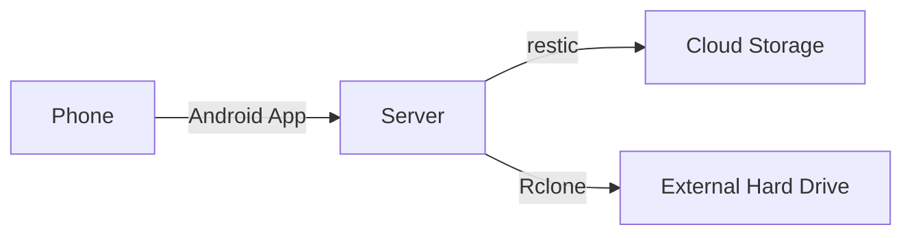

> Immich is a self-hosted photo and video management solution.
>
> Easily back up, organize, and manage your photos on your own server. Immich helps you browse, search, and organize your photos and videos with ease, without sacrificing your **privacy**.

I'm running [Immich](https://immich.app/) on a Beelink S12 Pro Mini PC that I bought off Amazon for $180. I'm using Docker Compose to run Immich following [these instructions](https://docs.immich.app/install/docker-compose/). I'm using [Nginx Proxy Manager](https://nginxproxymanager.com/) to set up a nice URL and handle SSL certificates.

## Backups

One of the big challenges of moving from Google Photos to Immich is figuring out a reasonable backup strategy. This is my backup strategy. There are many like it, but this one is mine. I follow the 3-2-1 backup rule:
- **3** copies of the data (server, cloud storage, and external hard drive[^1])
- **2** different types of media (cloud storage and external hard drive)
- **1** copy stored offsite (cloud storage)

[^1]: I like using an external hard drive because it provides protection against ransomware attacks. The downside is that I have to manually connect it to perform the backup, which means I'm less likely to do this regularly. A more robust solution might use B2's Object Lock: "Object Lock uses a write once, read many (WORM) 
model to prevent files from being deleted during a customer-determined retention period, providing immutable ransomware protection to protect data from modification, manipulation, 
or deletion." I decided against Object Lock to keep things simple and keep storage costs down.

I use [restic](https://restic.net/) to create encrypted backups in [B2 cloud storage](https://www.backblaze.com/cloud-storage) and [Rclone](https://rclone.org/) to sync to an external hard drive for local redundancy. Both restic and Rclone are excellent tools IMO.

## Motivation

Unfortunately, I have a history of mismanaging photos. See the timeline below:

| Month     | Event                                                                                                                                              |
|-----------|----------------------------------------------------------------------------------------------------------------------------------------------------|
| 2014-04   | [Dropbox Carousel](https://en.wikipedia.org/wiki/Dropbox_Carousel) released                                                                        |
| 2015-08   | Andrew and Meg get married!                                                                                                                        |
| 2015-09   | Andrew convinces Meg to organize wedding photos using Dropbox Carousel. Meg does a lot of work identifying the photos that bring us joy.           |
| 2016-03   | Carousel is deactivated, all of Meg's work is lost.                                                                                                |

As I move from Google Photos to Immich, I want to make sure I don't repeat my past mistakes. If I recruit Meg to organize photos in Immich, I want to be confident that I won't lose any of her work again.[^2]

[^2]: Meg says "I want AI to pick the good photos, not me!" Sounds like a great idea for a future post!