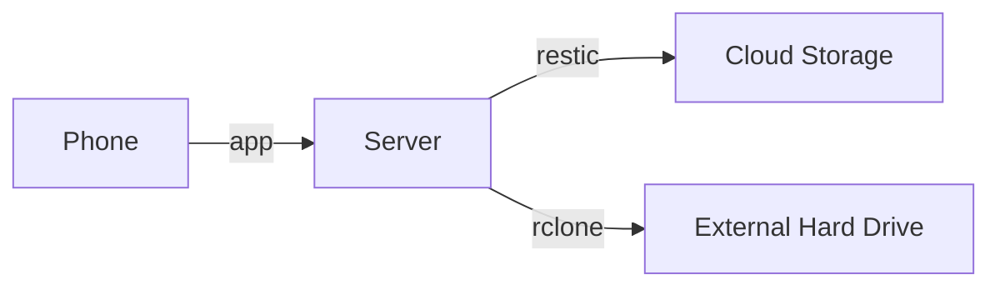

> Immich is a self-hosted photo and video management solution.
>
> Easily back up, organize, and manage your photos on your own server. Immich helps you browse, search, and organize your photos and videos with ease, without sacrificing your **privacy**.

I'm running [Immich](https://immich.app/) on a Beelink S12 Pro Mini PC that I bought from Amazon for $180. I'm using Docker Compose to run Immich following [these instructions](https://docs.immich.app/install/docker-compose/). I'm using [Nginx Proxy Manager](https://nginxproxymanager.com/) to set up a nice URL and handle SSL certificates.[^sockets]

[^sockets]: When setting up Immich in Nginx Proxy Manager be sure to enable "Websockets Support".

## Backups

One of the big challenges of moving from Google Photos to Immich is figuring out a reasonable backup strategy. This is my backup strategy. There are many like it, but this one is mine. I follow the 3-2-1 backup rule:
- **3** copies of the data (server, cloud storage, and external hard drive[^ransom])
- **2** different types of media (cloud storage and external hard drive)
- **1** copy stored offsite (cloud storage)

[^ransom]: I like using an external hard drive because it provides protection against ransomware attacks. The downside is that I have to manually connect it to perform the backup, which means I'm less likely to do this regularly. A more robust solution might use B2's Object Lock, which uses a write-once, read-many (WORM) model to prevent files from being deleted during a customizable retention period. I decided against Object Lock to keep things simple and keep storage costs down.

I use [restic](https://restic.net/) to create encrypted backups in [B2 cloud storage](https://www.backblaze.com/cloud-storage) and [rclone](https://rclone.org/) to sync to an external hard drive for local redundancy. Both restic and rclone are excellent tools IMO.



### restic

Below is the bash script I use to back up Immich using restic. I modified the backup script template from the [Immich docs](https://docs.immich.app/guides/template-backup-script). Here are the modifications I made:
- Use restic instead of Borg
- Perform remote backup only (don't make a local copy)
- Stop/start server during backup to guarantee SQL dump and files are consistent
- Add Immich and Postgres version numbers to SQL dump

```bash title=backup.sh
#!/bin/bash

MY_LIBRARY="/mnt/evo/photos/library"

# Get version information for tagging backups
IMMICH_VERSION=$(docker exec immich_server immich-admin version | tail -1)
POSTGRES_VERSION=$(docker exec immich_postgres postgres --version | sed 's/.*PostgreSQL) \([0-9.]*\).*/\1/')

# Stop Immich server to ensure a consistent backup
docker stop immich_server

# Create PostgreSQL database dump
docker exec -t immich_postgres pg_dumpall --clean --if-exists --username=postgres > ${MY_LIBRARY}/backups/immich-database-${IMMICH_VERSION}-pg${POSTGRES_VERSION}.sql

# Backup to Restic repository
restic backup ${MY_LIBRARY} --exclude ${MY_LIBRARY}/thumbs/ --exclude ${MY_LIBRARY}/encoded-video/

# Keep four weekly backups and three monthly backups
restic forget --path ${MY_LIBRARY} --keep-weekly 4 --keep-monthly 3 --prune

# Restart Immich server
docker start immich_server
```

I set up a cron job to run every night at 2 AM. I put this in the root user's crontab using `sudo crontab -e`:

```
0 2 * * * /absolute/path/to/backup.sh >> /var/log/immich-backup.log 2>&1
```

Since my cron job will create a database dump, we don't need Immich to create an additional dump every night. I turned off "Enable database dumps" via the Immich web interface (Administration > Settings > Database Dump Settings).

### rclone

Here is the rclone command I run on my laptop to sync files from my server to an external hard drive (connected to the laptop):

```shell
rclone sync beelink:/mnt/evo/photos/library local:/Volumes/Photos/library --progress
```

Note: it's quite probable that the database dump and files copied in this way will be out of sync. This isn't ideal, but for ease of use I'm comfortable making this compromise at the moment.

## Motivation

Unfortunately, I have a history of mismanaging photos. See the timeline below:

| Month     | Event                                                                                                                                              |
|-----------|----------------------------------------------------------------------------------------------------------------------------------------------------|
| 2014-04   | [Dropbox Carousel](https://en.wikipedia.org/wiki/Dropbox_Carousel) released                                                                        |
| 2015-08   | Andrew and Meg get married!                                                                                                                        |
| 2015-09   | Andrew convinces Meg to organize wedding photos using Dropbox Carousel. Meg does a lot of work identifying the photos that bring us joy.           |
| 2016-03   | Carousel is deactivated, all of Meg's work is lost.                                                                                                |

As I move from Google Photos to Immich, I want to make sure I don't repeat my past mistakes. If I recruit Meg to organize photos in Immich, I want to be confident I won't lose any of her work again.[^ai]

[^ai]: Meg says "I want AI to pick the good photos, not me!" Sounds like a great idea for a future post!

## References

These pages from the Immich docs were super helpful:

- [Install > Docker Compose [Recommended]](https://docs.immich.app/install/docker-compose/)
- [Administration > Backup and Restore](https://docs.immich.app/administration/backup-and-restore/)
- [Guides > Backup Script](https://docs.immich.app/guides/template-backup-script)