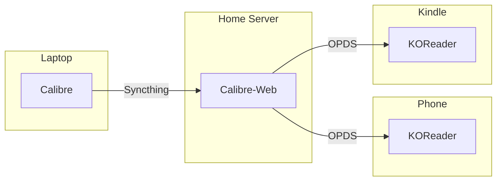

Oops!... I did it again! I went down another rabbit hole. This time I jailbroke my Kindle using [WinterBreak](https://kindlemodding.org/jailbreaking/WinterBreak/). Why did I do this?

- Over the weekend, I was reading a book on my Kindle and wanted to switch to reading on my phone. Jailbreaking would make that easier.
- I wanted to try out [KOReader](https://koreader.rocks/), which I've heard great things about.
- I have an extra Kindle lying around that I want to turn into a [TRMNL](https://trmnl.com/guides/turn-your-amazon-kindle-into-a-trmnl) eventually.

## My Setup

Below is a diagram of my setup. I manage e-books in Calibre on my laptop, then use Syncthing to automatically copy those files to my home server. From there, Calibre-Web serves them to my Kindle, phone, and other devices.



The workflow is simple:

1. Add or update a book in Calibre on my laptop
2. Syncthing syncs the change to the home server
3. On whichever device I want to read, open KOReader's OPDS browser, find the book, and download it

### Calibre

I've been using [Calibre](https://calibre-ebook.com/) on my laptop to manage e-books for years. It's excellent: I use it to organize my library, convert formats, and fetch metadata.

### Syncthing

[Syncthing](https://syncthing.net/) runs as a background service on both my laptop and my home server. I pointed it at my Calibre library folder and let it do its thing. It's reliable and completely automatic: whenever I add or update a book in Calibre, Syncthing pushes the changes to the server within seconds.

One thing to be mindful of: Calibre and Calibre-Web share the same `metadata.db` file. To avoid corruption, Calibre-Web mounts the library as read-only, so only Calibre on the laptop ever writes to the database.

### Calibre-Web

[Calibre-Web](https://github.com/janeczku/calibre-web) is a web application that sits in front of a Calibre library and serves it over HTTP. It has a web UI for browsing books, and more importantly for my purposes, it exposes an [OPDS](https://opds.io/) catalog.

OPDS is a standard for serving catalogs of books over HTTP. KOReader has a built-in OPDS browser that can connect to any OPDS server, browse the catalog, and download books directly to the device. Once Calibre-Web was running, I added it as an OPDS source in KOReader, and my entire library became available.

Calibre-Web runs on my home server with Docker Compose:

```yaml
services:
  calibre-web:
    image: lscr.io/linuxserver/calibre-web:latest
    volumes:
      - /path/to/calibre/library:/books:ro
      - calibre-web-config:/config
    ports:
      - "8083:8083"

volumes:
  calibre-web-config:
```

The default credentials for Calibre-Web are meant to be changed:

```yaml
username: admin
password: admin123
```

### KOReader

On both the Kindle and the phone, I configured KOReader's OPDS browser. In the file browser (this isn't available when a book is open), tap the magnifying glass icon, select OPDS, and add a new entry pointing to `http://<server>:8083/opds`. After that, my entire Calibre library was available to browse and download. KOReader's OPDS browser is a little clunky, but it works fine.

## Usage Notes

### Highlights

[Readwise](https://readwise.io/) is a popular service for aggregating highlights from many sources, including KOReader, into a single searchable library, but at $10/month it's more than I want to pay.

KOReader offers an "Export highlights" feature (`Tools > Export highlights`) that lets you save your highlights as Markdown files. I plan to export my highlights and manage them in [Obsidian](https://obsidian.md/). It's a manual step. I trigger the export and move the file into my knowledge base, but it's straightforward and free.

### Progress Sync

KOReader also includes a "Progress sync" feature that can sync your reading position to a remote server using the `kosync` protocol. I spun up [koreader-sync-server](https://github.com/koreader/koreader-sync-server) to try it out, but ultimately decided it wasn't worth the extra complexity for me. I rarely switch mid-book between devices, so I just use the OPDS browser to grab the book I want and manually find my spot.

## Jailbreaking

For the most part, the WinterBreak instructions are quite good. I ran into two issues while installing KUAL (Kindle Unified Application Launcher) and MRPI (MobileRead Package Installer).

The first time I typed `;log mrpi` into the search bar of my Kindle, it failed because there wasn't enough disk space for the installation. I needed to clear out about 1 GB.

The second time, the installation got further but still failed. I had Claude Sonnet read the log file and identify the problem.

```
FAT-fs (loop0): error, fat_get_cluster: invalid cluster chain (i_pos 1285765)
FAT-fs (loop0): Filesystem has been set read-only
```

The Kindle's internal storage had a corrupted FAT filesystem. When MRPI tried to extract the KUAL package, the filesystem had already been forced into read-only mode, so the write failed and the installer quietly gave up. The fix was to run a filesystem check from my Mac with the Kindle connected over USB:

```bash
diskutil unmount /dev/diskX
sudo fsck_msdos -y /dev/diskX
diskutil mount /dev/diskX
```

`fsck_msdos` found and repaired the bad cluster chain, and after that, `;log mrpi` worked. Third time's the charm!

## Conclusion

Overall, I'm stoked about my new system. KOReader is super customizable, so I can tweak the look of my books exactly how I want. Now I can focus on actually reading (instead of tinkering)! 📚