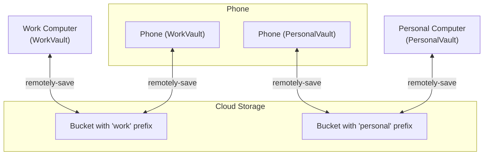

This is a guide for setting up Obsidian across a work computer, a personal computer, and a phone, keeping work and personal notes separate on the computers but accessible on the phone. This post covers two key tools:

1.  **remotely-save**: The excellent [remotely-save](https://github.com/remotely-save/remotely-save) plugin for syncing with Backblaze B2.
2.  **Obsidian Web Clipper**: The official [Web Clipper](https://obsidian.md/clipper) browser extension for saving web content.

## Remotely Save

The key to this setup is using separate "prefixes" within a single B2 bucket. Think of a prefix as a folder. We'll have:
- A `WorkVault` on your work computer, syncing to the `work/` prefix in your B2 bucket.
- A `PersonalVault` on your personal computer, syncing to the `personal/` prefix.
- Your phone will have two Obsidian vaults, one for work and one for personal, each syncing to its respective prefix.

This isolates the vaults where needed, while the `remotely-save` plugin allows your phone to access both.

##### Prerequisites

1.  **Obsidian:** Installed on your work computer, personal computer, and phone.
2.  **Backblaze B2 Account:**
    - Create a new, private bucket. Note its name (e.g., `my-obsidian-sync-bucket`).
    - Note your bucket's endpoint URL.
    - Create a new Application Key with read/write access to this bucket. Note the `applicationKeyId` and the `applicationKey`.

##### Step 1: Set Up Personal Vault (Personal Computer)

1.  **Create Vault:** On your personal computer, open Obsidian and create a new vault. Let's call it `PersonalVault`.
2.  **Install Plugin:** Go to `Settings > Community plugins`, turn on community plugins, and install `remotely-save`. Enable it.
3.  **Configure Sync:**
    - Open the `remotely-save` settings.
    - For `Choose a cloud service`, select `S3`.
    - Fill in your Backblaze B2 details:
        - **Endpoint:** Your B2 endpoint URL (e.g., `s3.us-west-004.backblazeb2.com`).
        - **Region:** The region part of your endpoint (e.g., `us-west-004`).
        - **Bucket name:** The name you chose earlier.
        - **Access Key ID:** Your `applicationKeyId`.
        - **Secret Access Key:** Your `applicationKey`.
    - **Set Prefix:** In the `Sync (S3)` section, set the **Prefix** to `personal`. This is the most important step for keeping vaults separate.
    - **Enable Encryption:** It's highly recommended to set a password for end-to-end encryption. Choose a strong password and save it securely.
4.  **First Sync:** Open the command palette (`Cmd/Ctrl+P`) and run `Remotely Save: Start syncing`. Or click the sync icon in the left ribbon. The first sync will upload all your files.

##### Step 2: Set Up Work Vault (Work Computer)

Repeat the exact same process on your work computer, but with these two critical differences:

1.  **Create Vault:** Create a new vault named `WorkVault`.
2.  **Set Prefix:** When configuring `remotely-save`, set the **Prefix** to `work`.

You can use the same encryption password or a different one.

##### Step 3: Set Up Your Phone

On your phone, you'll set up two vaults to connect to your remote storage.

##### Syncing the Personal Vault:
1.  **Create Vault:** Open Obsidian on your phone and create a new, empty vault. Name it `PersonalVault` to match your personal computer.
2.  **Install & Configure Plugin:** Install and enable the `remotely-save` plugin.
3.  **Configure Sync:** Enter the **exact same S3 credentials, bucket name, `personal` prefix, and encryption password** as your personal computer.
4.  **Sync:** Run sync. The plugin will detect the remote files and download them to your phone.

##### Syncing the Work Vault:
1.  **Create Vault:** Go back to the vault switcher in the Obsidian app, and create another new, empty vault. Name it `WorkVault`.
2.  **Install & Configure Plugin:** Install and enable `remotely-save` in this new vault.
3.  **Configure Sync:** Enter the **exact same S3 credentials, bucket name, `work` prefix, and encryption password** as your work computer.
4.  **Sync:** Run sync to pull down your work notes.

You can now switch between the `PersonalVault` and `WorkVault` on your phone using the vault switcher.

##### Architecture Diagram

## Obsidian Web Clipper

Obsidian has an official [Web Clipper](https://obsidian.md/clipper) browser extension that makes it easy to save web content directly into your vaults. I enjoy using it to save articles I want to read later.

##### Setup
1.  **Install the Extension:** Add the Obsidian Web Clipper to your browser (available for Chrome, Firefox, Safari, and Edge) from the [official page](https://obsidian.md/clipper).
2.  **Configure Vaults:** In the extension's settings, you will need to connect it to your Obsidian application. It should be able to detect and let you choose between your different vaults.
3.  **Clipping:** When you're on a page you want to save, activate the clipper. You can:
    - Clip the entire article as a clean Markdown file.
    - Select and clip only specific highlights.
    - Choose which vault (`PersonalVault` or `WorkVault`) and folder to send the clip to.
    - Apply pre-configured templates to format the note with metadata like the source URL, author, and date.

This integrated solution allows you to send web content to the correct vault directly from your browser. The clipped files will then be synced by `remotely-save` along with the rest of your vault.

##### A Note on Mobile Web Clipping (Firefox on Android)
The Obsidian Web Clipper extension is fully supported on Firefox for Android and is designed to open the Obsidian app directly to create a new note.

However, a temporary bug in Firefox version 140 for Android prevented this from working correctly, causing the clipper to fall back to a copy-and-paste behavior. As noted in [this GitHub issue](https://github.com/obsidianmd/obsidian-clipper/issues/527), this bug was fixed in **Firefox version 140.0.3**.

If you experience issues where the clipper does not open Obsidian automatically, please ensure your Firefox for Android app is updated to the latest version.
