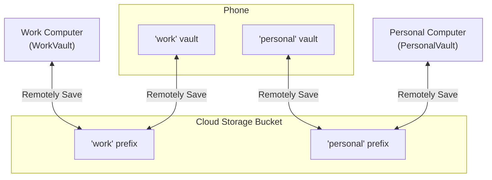

My Obsidian workflow relies on three plugins and one browser extension.

## Obsidian Tasks

I use [Obsidian Tasks](https://github.com/obsidian-tasks-group/obsidian-tasks) to track tasks across my vaults. The simplest way to create a new task is to add a checklist item. The Markdown syntax for a checklist item is a list item that starts with square brackets followed by a space:

<pre>
- [ ] take out the trash
</pre>

Then I have a file with the following snippet to list all open tasks across my vault:

<pre>
```tasks  
(not done)  
```
</pre>

The plugin offers many features I'm not using, but the ability to see all my open tasks across all files is the one I really value.

## Obsidian Web Clipper

The [Obsidian Web Clipper](https://obsidian.md/clipper) is fantastic. With a single click I can turn any website into a clean Markdown file in my vault. This is great for saving articles to read later or adding emails to my to-do list.

⚠️ **Android gotcha:** Firefox 140 introduced a bug that prevents the clipper from opening Obsidian (see [issue #527](https://github.com/obsidianmd/obsidian-clipper/issues/527)). It was fixed in **140.0.3**—update Firefox if the extension does not open Obsidian automatically.

## Remotely Save

[Remotely Save](https://github.com/remotely-save/remotely-save) is good but not great. For most Obsidian users I recommend the official [Obsidian Sync](https://obsidian.md/sync) service. I use Remotely Save to avoid Obsidian Sync's $10 per-month subscription.

I store both my personal and work notes in a single Backblaze B2 bucket. The magic trick is to give each vault its own **prefix**:

- `personal/` for my personal vault  
- `work/` for my work vault  

This setup keeps the vaults isolated on my computers while allowing my phone to open both.

##### Architecture



## Outliner

If you want to reorganize outlines quickly, then [Obsidian Outliner](https://github.com/vslinko/obsidian-outliner) is the way to go. On my computer it lets me drag and drop list items, so I can re-order lists and modify how items are nested. On my phone, Outliner provides four mobile quick actions:

1. Move list and sublists up
2. Move list and sublists down
3. Indent the list and sublists
4. Outdent the list and sublists

I've configured my mobile toolbar so these four actions are readily available, allowing me to edit my outlines quickly when I'm on my phone.