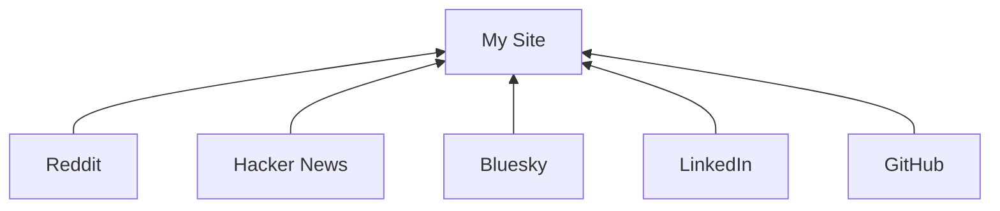

I just learned about POSSE:

> POSSE is an abbreviation for Publish (on your) Own Site, Syndicate Elsewhere, the practice of posting content on your own site first, then publishing copies or sharing links to third parties (like social media silos) with original post links to provide viewers a path to directly interacting with your content.

I want to own my content on the web. Here's how I intend to do it:

1. Publish content on my site first.
2. Share links on silos where I get useful feedback (Reddit, Hacker News, Bluesky, LinkedIn, GitHub).
3. If I get useful feedback in a silo, I may link back to it.

To learn more check out [indieweb.org/POSSE](https://indieweb.org/POSSE).