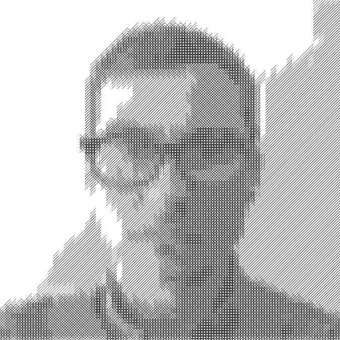

I'm a big fan of the Wall Street Journal's hedcuts. I looked into how to create my own hedcut using the computer. It turns out it's not that easy, and the automated methods end up creating not-so-great hedcuts. I decided it would be fun to create a drawing that would be easy for the computer to make, but hard for a human to draw. You can see the results below. One thing I like about making art with code is that I can feel free to write messy code!

## 2022-06-17

Code: [v2.py](/profile-pic/v2.py)

## 2022-02-11

Code: [v1.py](/profile-pic/v1.py)
