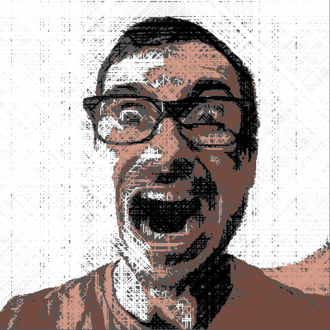

import ReadFile from '@/components/ReadFile.astro';

I've always been a big fan of the Wall Street Journal's [hedcuts](https://www.google.com/search?q=wsj%2Bheduct&tbm=isch). I looked around a bit for how to create my own hedcut using the computer. It turns out it's not that easy and they end up creating mediocre hedcuts. I decided it would be fun to create a drawing that would be easy for the computer to make, but hard for a human to draw. You can see the result above. I think it looks pretty sweet!

## New New Profile Pic!

Although I like the first portrait I made with this code, it's a bit too intense for regular Twitter use. I've toned things down dramatically in version 2.0:

Now I'm way too serious, but we can chill with this version for a bit.

## Code

One thing I like about making art with code is I can feel free to write crappy code. The code below makes the latest portrait. It's really messy and that's great!

<ReadFile file="src/content/post/profile-pic/draw.py" lang="python" title="draw.py" /> 