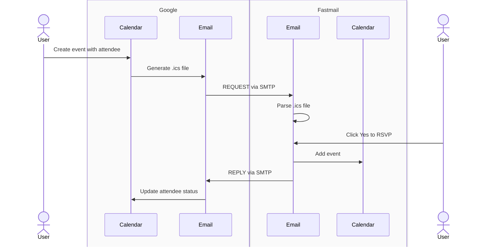

Currently, I have three email accounts!

1. Gmail
2. Proton Mail
3. Fastmail

I just ran an experiment where I created a Google Calendar event inviting my Proton Mail and Fastmail accounts. I RSVP'ed yes from both email accounts. When I open my Google Calendar I can see the response from my Proton Mail account but not my Fastmail account. In my ideal world, web standards would clearly define how these interactions should work, and service providers would follow the standards so that services could interoperate. This led me to the following questions:

- Are there web standards that outline how these services should communicate?
- If yes, who isn't following the standards / who can I blame?

The answers below come from Claude Opus 4.5.

## How It Should Work

Calendar interoperability between different email providers is governed by three IETF standards:

1. **iCalendar** (RFC 5545) - defines the `.ics` file format for representing calendar events, including properties like `VEVENT`, `ORGANIZER`, `ATTENDEE`, and `UID`.

2. **iTIP** (RFC 5546) - the iCalendar Transport-Independent Interoperability Protocol, which defines the semantics of calendar scheduling messages: `REQUEST` (invite), `REPLY` (RSVP), `CANCEL`, etc.

3. **iMIP** (RFC 6047) - the iCalendar Message-Based Interoperability Protocol, which specifies how to transport iTIP messages via email using MIME types and SMTP.

When I create an event on Google Calendar and invite someone using Fastmail, here's what should happen:

The standards are clear: the REPLY must include `METHOD:REPLY`, the same `UID` as the original event, and an `ATTENDEE` property with the updated `PARTSTAT` (ACCEPTED, DECLINED, or TENTATIVE). The email must have the correct MIME type (`text/calendar; method=REPLY`).

## How It Currently Works

In practice, providers implement these standards inconsistently:

| Provider | iCalendar | iTIP | iMIP | Notes |
|----------|-----------|------|------|-------|
| **Google** | ✅ | ⚠️ | ⚠️ | Sends correctly, but receiving RSVPs from non-Google accounts is unreliable |
| **Fastmail** | ✅ | ✅ | ⚠️ | Full iMIP processing, but documented issues with Google and Yahoo |
| **Proton Mail** | ✅ | ✅ | ✅ | Good external invitation support |

**So who's at fault - Google or Fastmail?**

The evidence points to Google. According to Stack Overflow discussions and Microsoft Q&A posts, Google Calendar has a known limitation: "Invitees must have an active Google Calendar account associated with their email address for RSVP responses to be captured and visible to the organizer."

This means Google's iMIP implementation for *receiving* replies is incomplete. Rather than processing any standards-compliant iMIP REPLY, Google appears to expect responses from within its own ecosystem. Fastmail's help documentation also notes "known issues with Yahoo and Google" in their calendar troubleshooting - suggesting they've encountered this problem from their end too.

The fact that Proton Mail's RSVP worked while Fastmail's didn't could be due to:
- Proton implementing Google-specific workarounds
- Subtle differences in how each formats their REPLY messages
- Inconsistent behavior on Google's receiving end

The irony is that Fastmail is generally considered more standards-compliant than Google for calendar protocols (they support CalDAV; Google uses proprietary APIs). Yet their standards-compliant RSVP didn't register with Google, while Proton's did. This is the classic problem with dominant platforms: if you want to interoperate with Google, you sometimes have to accommodate their specific behavior rather than just following the RFC.