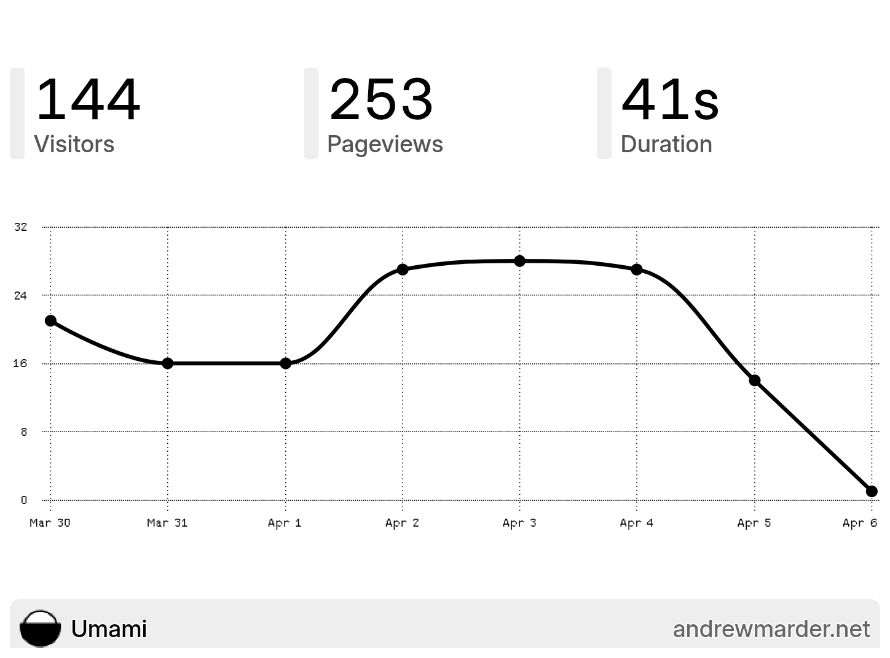

  <iframe 
    src="https://www.youtube.com/embed/D0wQ8gCxCvw?si=xdFaZu__ZaTw-a99" 
    title="YouTube video player"
    frameborder="0"
    allow="accelerometer; autoplay; clipboard-write; encrypted-media; gyroscope; picture-in-picture; web-share"
    referrerpolicy="strict-origin-when-cross-origin"
    allowfullscreen
    style="position: absolute; top: 0; left: 0; width: 100%; height: 100%;"
  ></iframe>

I've been eyeing the TRMNL X - it looks like some sweet hardware. But I'm cheap. When I learned it was possible to transform an old Kindle into a TRMNL, I had to try it before shelling out for the real thing. I had an old Kindle sitting on a shelf, so off I went. Here are my notes on the process.

**Things That Didn't Work Well**

I tried a few things that didn't work for me:

1. **[Terminus](https://github.com/usetrmnl/terminus)** -- TRMNL's open source Bring Your Own Server (BYOS). After spinning it up, I discovered it doesn't currently support plugins, which was a dealbreaker for me.

2. **[TRMNL's trmnl-kindle code](https://github.com/usetrmnl/trmnl-kindle)** -- This code kind of works, but the Kindle OS was still drawing its clock over my dashboard, another dealbreaker.

3. **[Nick Winans' Umami plugin](https://github.com/Nicell/trmnl-umami)** -- Following the longstanding tradition of blogging about blogging, I wanted to display my web analytics on my dashboard. Nick's plugin was a helpful starting point, but it didn't seem to work with Umami Cloud.

**What I Landed On**

After some tinkering, I settled on three open source tools that now power my setup:

1. **[LaraPaper](https://github.com/usetrmnl/larapaper)** -- A TRMNL BYOS alternative that supports plugins. This replaced Terminus.

2. **[trmnl-kindle](https://github.com/amarder/trmnl-kindle)** -- My modified version of TRMNL's Kindle code, tweaked so the Kindle OS doesn't draw on my dashboard.

3. **[trmnl-umami](https://github.com/amarder/trmnl-umami)** -- A custom Umami Analytics plugin, built on Nick's work.

**A Word of Warning**

The software I've posted still has many rough edges:

1. trmnl-kindle crashes when I try to start it via KUAL.
2. trmnl-kindle has not been optimized to extend battery life.
3. trmnl-umami only supports full layout (not half or quadrant layouts).

If you're interested in using any of this, please reach out. Knowing someone else wants to use it would motivate me to fix these issues.

**Overall**

I'm very happy with my new dashboard. It gives me a dedicated place to glance at things I'd otherwise pull out my phone to check: weather, web analytics, finances. Now I can see all of that without getting sucked into my phone.