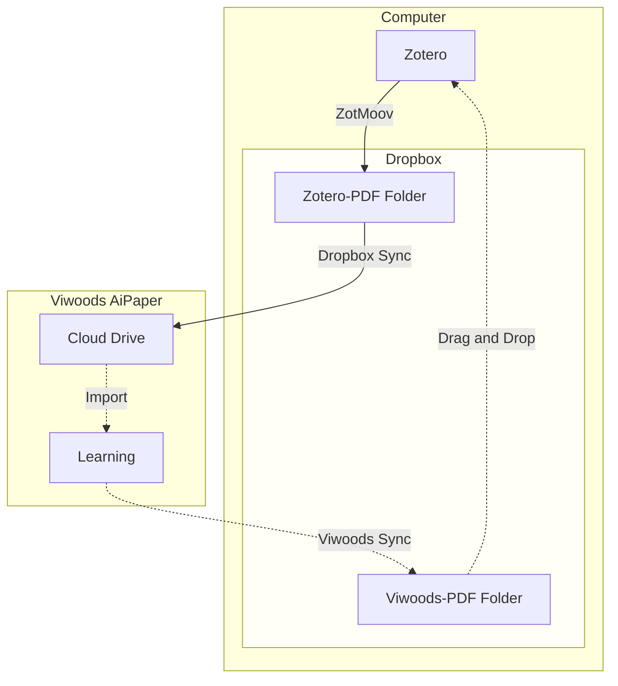

I splurged and got myself an E-Ink tablet, specifically the [Viwoods AiPaper](https://www.amazon.com/VIWOODS-Electronic-Ultra-Thin-Lightweight-Note-Taking/dp/B0DZ1TJYLN?tag=andrewmarder-20).
I appreciate that it runs Android and doesn't push me into a subscription model.
It's a quirky product, so I wanted to share some notes about how I use it.
I have two main use cases:

1. Taking notes
2. Reading PDF files

For taking notes, I use the "Paper" app.
For reading PDFs, I use the "Learning" app.

## Sync

I use [Zotero](/zotero) on my computer to manage references and PDF files.
I've set up ZotMoov to store Zotero attachments in a Dropbox folder.
I've also connected the tablet to my Dropbox account so I can easily import PDF files from Dropbox into the Learning app.
When I'm done annotating a PDF file, I use Viwoods Sync to push that document up to Dropbox, then manually drag and drop the annotated file back into Zotero.
The solid lines in the diagram below represent automatic processes, the dotted lines represent manual steps.
Overall, I think this flow is good enough (not perfect).

## Stylus

The stylus that comes with the Viwoods AiPaper is okay.
I think the Apple Pencil is an excellent input device; it has great weight, a smooth writing experience, and feels solid in the hand.
I would give the Apple Pencil an "A" and the Viwoods stylus a "B".
My main complaint with the Viwoods stylus is that the eraser and button rattle slightly, making it feel less solid.
I tried (and returned) two other styluses:

1. [STAEDTLER Noris Classic](https://www.amazon.com/dp/B0728HBD7F?tag=andrewmarder-20)
2. [STAEDTLER Noris Jumbo](https://www.amazon.com/dp/B086N4KK7Z?tag=andrewmarder-20)

The Noris Classic was solid (no button, no eraser, no rattle), but it was too light, and too thin to be held by the loop on the case.
The Noris Jumbo had an eraser and a slight rattle.
The Jumbo was probably *slightly* better than the Viwoods stylus, but not enough to justify the price.
I wish rOtring made an EMR stylus, I love their mechanical pencils.
If you have any stylus suggestions, definitely let me know in the comments.

## iPad Comparison

Back in 2019, I bought a second-generation Apple Pencil and a first-generation 11-inch iPad Pro.
They both work great.
As a general-purpose tablet, the iPad crushes the AiPaper:

- I prefer the Apple Pencil to the Viwoods stylus
- The software available on the iPad is superb.
    - [Notability](https://notability.com/) is way better than Viwoods Paper.
    - [PDF Expert](https://pdfexpert.com/) is way better than Viwoods Learning.

Here are the places where the AiPaper excels:

-   **Battery life**.
    The stylus doesn't require electricity.
    The Apple Pencil drains the iPad battery.
    I have to charge the iPad daily, and if I leave the pencil attached when storing the iPad, the iPad battery will be completely drained when I return to it.
    The AiPaper's battery life is excellent.

-   **Focus**.
    Since the iPad is a general-purpose device, it can be quite distracting.
    The AiPaper is less distracting, which is particularly beneficial during meetings.

-   **Weight**.
    The AiPaper is lightweight and thin.
    My iPad is somewhat bulky (though the new iPad Pro weighs only 444 grams compared to the AiPaper's 370 grams).

-   **Discreet**.
    I like the monochrome screen.
    When I take notes with the AiPaper in meetings, people are less likely to worry that I'm multitasking or not paying attention.

The iPad is like a great chef's knife: super versatile. The AiPaper is like a great paring knife: it's luxurious to have around, but cooking a meal with it would be painful.